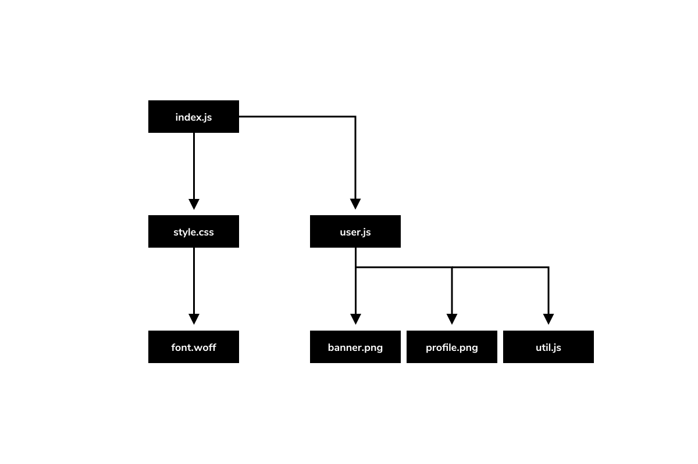
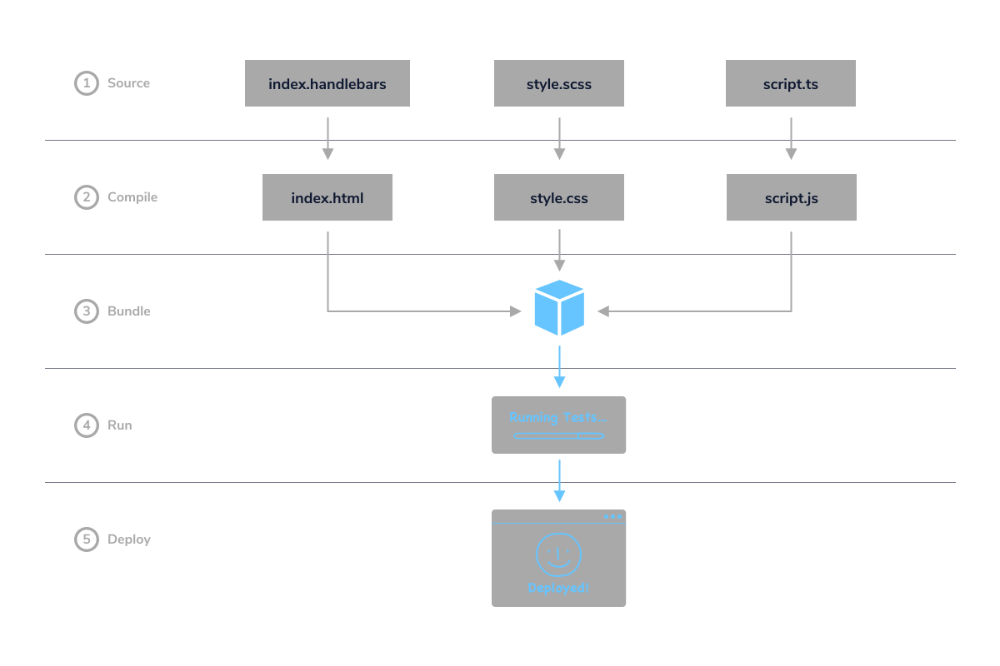

 # Notes on Build Tools for Web Apps

### Build Tools
1. **Package Managers**:  npm, yarn 
2. **Bundlers**: Webpack, Vite, Parcel, esbuild
3. **Task Runners**: Github Actions, Gulp.js, Grunt, Circle CI

### Stages of Development
1. Development (HTML, CSS, JavaScript, React, Node.js)
2. Testing (Mocha, Jest, Selenium)
3. Deployment (Task Runner, Bundler)

>The process of testing and deployment can be automated by task runners, and the content served in the deployment stage is often produced by bundlers.

------
### Task Runners
* Automate particular development processes (like compiling code from SCSS to CSS or TypeScript to JavaScript)

### Bundlers
* package JavaScript files, stylesheets, fonts, etc into bundled files. Removes unused/duplicated code and improves download speed.

* The bundler maps the connections between assets in a **dependency graph.** 

>A **dependency graph**  is a type of data structure formed by a directed graph representing the relationship between different files. It maps the connections between different files to tell the bundler what needs to be included in order to build the application.
 When one file depends on another, a connection is added to the graph. Once all the connections are added, the bundler knows exactly what it must incorporate into the build.
 
 index.js depends on two files: style.css and user.js.  
style.css also has a dependency for a font file, font.woff.  
user.js depends on another JavaScript file, util.js, and two image assets, banner.png and profile.png.

------

## **Improving Performance**

To optimize applications, build tools use a variety of processes including: code-splitting, minification, dead-code elimination, and tree-shaking.

**Code-splitting** allows you to split your code into multiple files or chunks that can be loaded as needed.

**Minification** removes comments, whitespace, and other unneeded data from your code. References in the code can also be renamed so that the resulting bundle is smaller.

**Dead-code elimination** aims to remove any code not actually used by the finished application. 

**Tree-shaking** is a type of dead-code elimination that searches included modules for files and functions that are not used.

Build tools use different combinations of these to help streamline web apps.

 >
 1. Source, 2. Compile, 3. Bundle, 4. Run, 5. Deploy

------

## **Linting**
A linter is a tool that scans source code for potential issues, including syntax errors, faulty code structures, stylistic inconsistencies, and security. Linters can automatically detect missing semicolons or future security breaches early on during the development cycle to reduce the number of errors that need to be resolved during testing. Some popular linters include ESLint for JavaScript, JSHint for JavaScript, and Stylelint for CSS.
